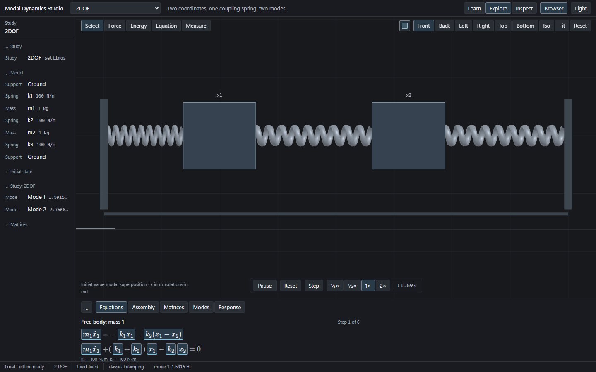
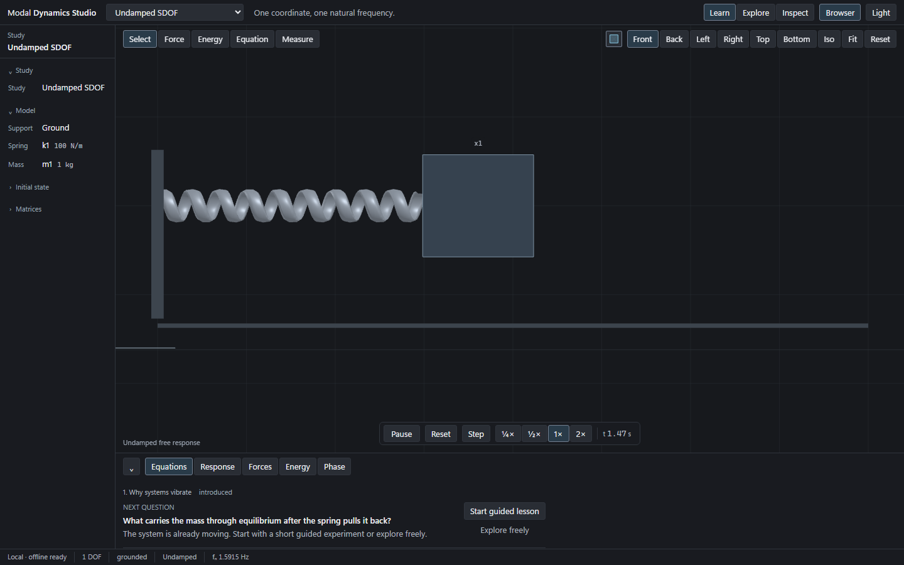
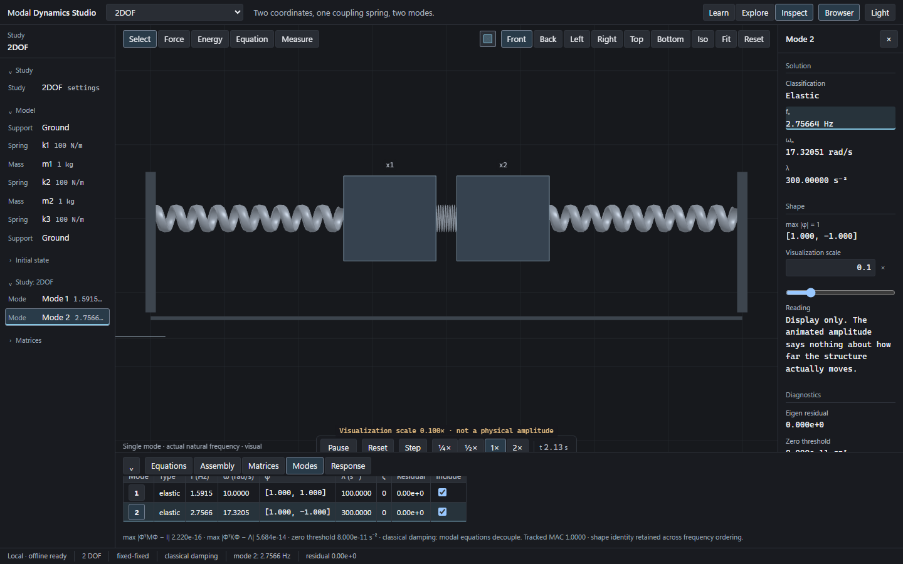
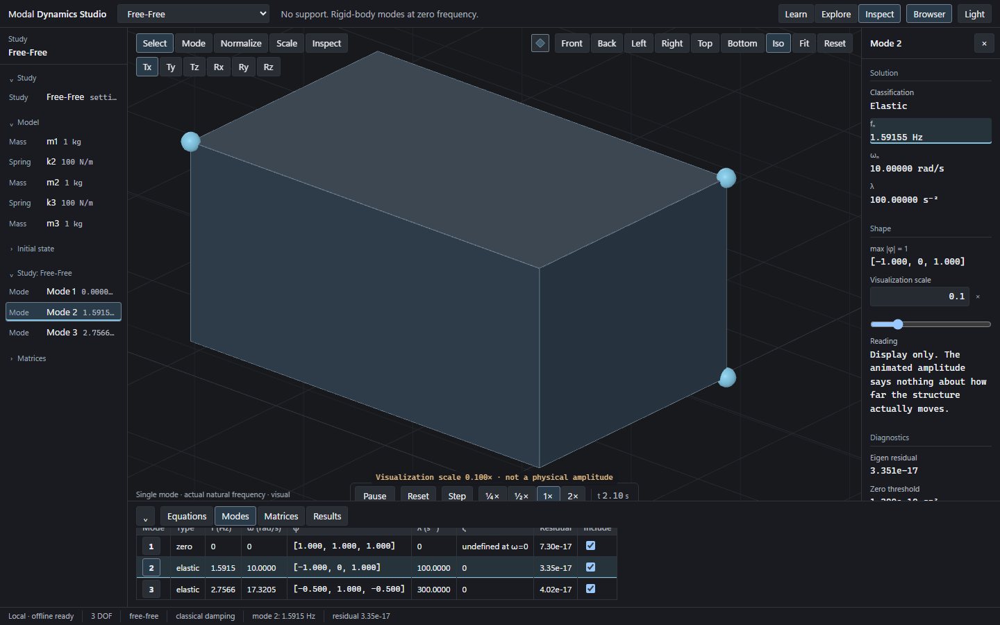
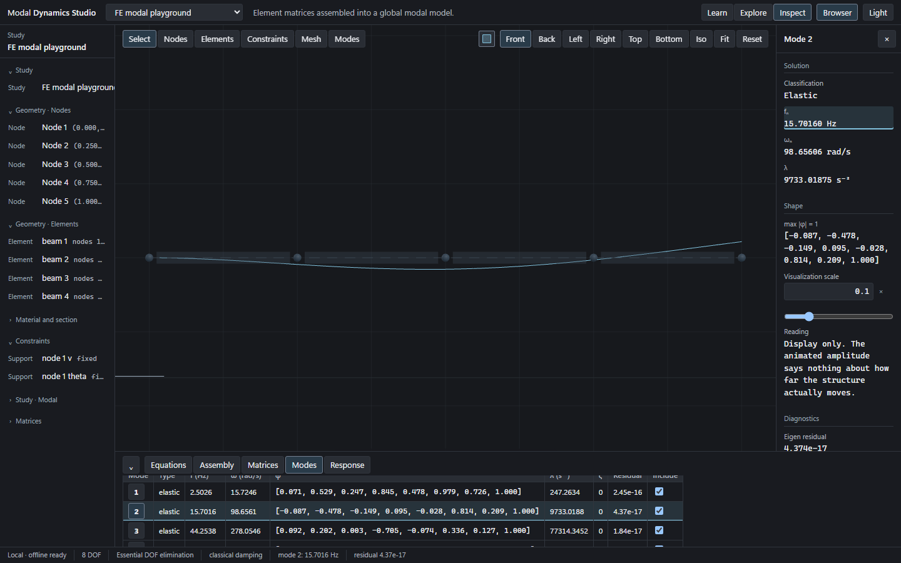
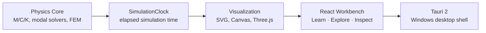

# Modal Dynamics Lab

**Interactive Structural Dynamics & Modal Analysis Workbench**

[](https://github.com/halici21/modal-dynamics-lab-desktop/actions/workflows/ci.yml)
[](https://github.com/halici21/modal-dynamics-lab-desktop)
[](https://tauri.app/)
[](https://www.typescriptlang.org/)

An interactive Windows desktop workbench for learning and exploring vibration, modal analysis, frequency-response behavior, and educational finite-element dynamics. The application keeps physical motion, equations, matrices, graphs, and mode shapes connected in one offline-first workspace.



## What is Modal Dynamics Lab?

Modal Dynamics Lab is a local-first scientific instrument for structural-dynamics study. It is designed for the moment when a learner or engineer wants to move from a physical question to a computed result without losing the connection between them.

The current Windows runtime is **Tauri 2 + Vite + React + TypeScript**. Numerical models run in the local TypeScript physics core; the Tauri shell provides the desktop window and native boundary. Core exploration works offline.

## See it in action

Each capture is from the current application at a consistent 1440×900 viewport.

<table>
  <tr>
    <td><br><sub><strong>SDOF / Learn</strong> — a mass–spring system beside its guided question and response.</sub></td>
    <td><br><sub><strong>Modal analysis</strong> — a selected mode shape, frequency, normalization and residual in one view.</sub></td>
  </tr>
  <tr>
    <td><br><sub><strong>Free-Free</strong> — rigid-body zero frequency and elastic modes share the same model.</sub></td>
    <td><br><sub><strong>Educational FEM</strong> — a beam mesh, interpolated mode shape and modal table.</sub></td>
  </tr>
</table>

## Core capabilities

**Free vibration**

- Undamped and damped SDOF response
- Energy, phase-space, decay-envelope and regime views

**Coupled and modal systems**

- 2DOF, 3DOF and 2–10 DOF educational chains
- Generalized eigenvalues/eigenvectors, mode shapes, normalization and sign handling
- Modal superposition, MAC and residual diagnostics

**Frequency and input behavior**

- Forced SDOF response and complex FRF views
- Uniform base excitation, participation and effective modal mass

**Environmental dynamics**

- Response-spectrum fundamentals
- Stationary PSD and RMS interpretation

**Free-Free systems**

- Rigid-body modes at approximately zero frequency
- Elastic modes and conceptual rigid-body bases

**Educational finite elements**

- Axial bar, Euler–Bernoulli beam and planar-frame models
- Element matrices, global assembly, boundary conditions and mesh refinement

## Learning path

The local course flow is compact by design:

`SDOF → Damping → Forced Response → FRF → Coupled Systems → Modes → Base Excitation → Free-Free → Spectra / PSD → FEM`

The same workbench can be used in **Learn**, **Explore** or **Inspect** mode. Learn asks for a prediction before revealing the relationship; Explore keeps direct manipulation; Inspect exposes matrices, residuals, normalization and solver evidence.

## Numerical credibility

- `89/89` unit and numerical tests pass.
- `121/121` interaction, accessibility and visual tests pass on the validated Windows baseline.
- Analytical reference cases cover SDOF, damping, forced response, FRF, modal response, free-free zeros and FE convergence.
- Independent NumPy/SciPy oracle fixtures validate generalized modes, complex FRFs, spectra, PSD and finite-element results.
- Physics, animation, visualization, UI state and native desktop responsibilities remain separated.

See the [full physics report](docs/FULL_PHYSICS_R1_REPORT.md), [pedagogy report](docs/PEDAGOGY_R1_REPORT.md) and [documentation index](docs/README.md) for the evidence trail.

## Architecture



The visualization layer consumes solved physical values; it does not invent motion. The native layer stays narrow so the core remains testable and offline.

## Quick start

Windows development requires Node.js and the Rust toolchain used by Tauri.

```powershell
git clone https://github.com/halici21/modal-dynamics-lab-desktop.git
cd modal-dynamics-lab-desktop
npm ci
```

For fast frontend iteration:

```powershell
npm run dev
```

For the actual Tauri desktop window:

```powershell
npm run desktop:dev
```

## Development and testing

```powershell
npm test
npm run test:ui
npm run typecheck
npm run build
```

`npm run desktop:build` also compiles the native release executable. Local NSIS packaging currently encounters a Windows reparse-point error (`os error 4395`); no installer is committed or uploaded. Packaging output is written to the ignored `artifacts/` directory.

## Documentation

Start with the [documentation index](docs/README.md). It routes public readers to:

- [Architecture](docs/FULL_PHYSICS_R1_ARCHITECTURE.md) and [numerics](docs/FULL_PHYSICS_R1_NUMERICS.md)
- [Finite-element models](docs/FULL_PHYSICS_R1_FEM.md)
- [Pedagogy and course flow](docs/PEDAGOGY_R1_REPORT.md)
- [Validation and test matrix](docs/FULL_PHYSICS_R1_TEST_MATRIX.md)
- [Visual/runtime specifications](docs/VISUAL_MOTION_SPEC_V1.md) and [desktop runtime](docs/DESKTOP_RUNTIME_SPEC_V1.md)
- Historical implementation and release reports, kept under `docs/` for traceability

## Project status

The public repository tracks the validated `0.4.0` desktop workbench: full linear dynamics and educational FEM foundations, the Visual Experience R2 shell, and the Pedagogy / Course Flow R1 layer. This presentation pass changes documentation, screenshots and repository automation only; it does not change physics or product behavior.

## License

No project license has been selected yet. A license should be chosen before external redistribution is expected.

## Acknowledgements

The runtime uses [Tauri](https://tauri.app/), [React](https://react.dev/), [Vite](https://vite.dev/), [Three.js](https://threejs.org/), [ml-matrix](https://github.com/mljs/matrix), [KaTeX](https://katex.org/) and [Playwright](https://playwright.dev/). NumPy and SciPy are used as development-time numerical oracles; they are not required by the desktop application at runtime.
