# Pedagogy R1 — concept dependency graph

```mermaid
flowchart LR
  A[restoring force] --> B[natural frequency]
  B --> C[damping and energy loss]
  C --> D[forced response]
  D --> E[resonance and FRF]
  E --> F[coupled coordinates]
  F --> G[eigenproblem]
  G --> H[mode shapes]
  H --> I[normalization and sign]
  I --> J[modal superposition]
  J --> K[base excitation]
  K --> L[participation and effective mass]
  L --> M[free-free rigid modes]
  M --> N[response spectrum / PSD]
  N --> O[FEM element assembly]
```

| Prerequisite | Concept | Evidence | Next |
|---|---|---|---|
| restoring force | natural frequency | stage period and ωₙ output | damping |
| natural frequency | damping | decaying amplitude and energy | forcing |
| damping | forcing | response amplitude and phase | FRF |
| forcing | FRF | scrub-linked H(Ω) | 2DOF |
| coupled coordinates | eigenproblem | M/K assembly and roots | mode shapes |
| eigenproblem | mode shape | relative vector animation | normalization |
| mode shape | modal superposition | sum of selected modes | base excitation |
| base motion | participation | Γ and cumulative mass | free-free |
| free-free | rigid-body interpretation | zero-frequency shape | spectra |
| damped oscillator family | spectrum/PSD distinction | maxima versus density/RMS | FEM |
| modes and matrices | FEM modal | element-to-global assembly | independent interpretation |

The rail communicates Current, Next, Completed and Recommended prerequisite through accessible labels and restrained status text. It never locks an advanced workspace.
